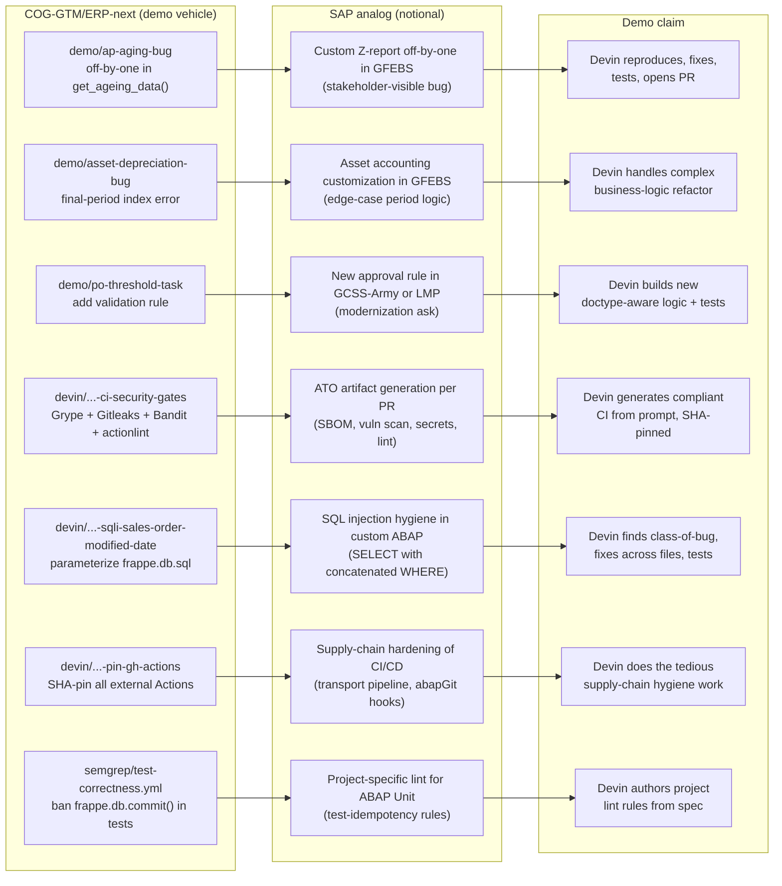

# ASIC — Devin Value Proposition for SAP ERP + Low-Code Platform Modernization

**Owner:** Cognition Federal GTM
**Status:** Internal preparation material — not for external distribution without review
**Audience:** Cognition sales/SE team prepping the Crystal Chadwick (Division Chief, ASIC Mission Management Division) follow-up
**Sister doc:** `COG-GTM/federal_RFP_responses/ASIC-ERP-DevSecOps-Demo-Prep/` (meeting tactics, talk track, deep research). This document is the **SAP-and-low-code value framing** that lives in the demo-vehicle repo.

---

## 0. About this document

This is internal preparation material, not a customer-facing pitch deck. It is written to be useful to a Cognition AE/SE walking into a conversation with ASIC about (a) the five SAP ERPs ASIC manages and (b) the five designated low-code/no-code "landing zone" platforms that sit alongside them. It is designed to be **brutally honest** — including about the gaps — because over-promising into a federal program office is a slow-moving disaster and the audience can smell it from across the table.

Three operating principles applied throughout:

1. **No fabrication.** Where we don't know something (the names of the 5 SAP systems, which 5 low-code platforms, abapGit posture, network/IL designation per system), we say so and frame it as a discovery question. We do not invent.
2. **Honest confidence ratings.** Every claim about Devin's value carries a confidence rating: **High** (proven across multiple federal/commercial engagements), **Medium** (proven in some contexts, plausible but not yet demonstrated at scale in this specific shape), or **Low** (theoretically reasonable, no evidence yet). If we don't have a confidence basis, we don't make the claim.
3. **Differentiation, not duplication.** Where Appian, Pega, ServiceNow, Mendix, OutSystems already cover a capability, we do not pretend Devin replaces them. We frame Devin as the **engineering layer beneath the low-code layer** — the thing that builds connectors, custom services, and the integration glue that low-code platforms structurally cannot.

If anything in this doc reads as marketing rather than analysis, flag it. Internal-honest > externally-polished.

---

## 1. Executive summary

ASIC has a "keep legacy + modernize" decision pending for its five SAP ERPs, and five designated low-code/no-code landing zone platforms already on the menu for net-new application work. The thesis Cognition should walk in with is:

**Devin is the engineering capacity that makes "keep + modernize" actually work, and the engineering layer that makes the low-code investments deliver on their promise.**

Concretely, three outcomes:

| Outcome | Who feels it | One-liner |
|---|---|---|
| **Cost reduction on cleared SAP labor** | ASIC ops + program office finance | Cleared SAP ABAP developers run $150–250/hr fully loaded; the labor pool is shrinking faster than demand. Devin lets a smaller cleared team deliver the same throughput by handling the comprehension-heavy and boilerplate-heavy parts of every change. |
| **Speed on the modernization-without-replacement path** | ASIC division chief + ERP program teams | Most of the modernization work is *not* greenfield — it's "make the legacy ERP API-accessible, make the custom Z-programs documented and testable, and make the integration layer to Appian/Pega/etc. real." Devin compresses that work from quarters to weeks. |
| **Risk reduction via STIG/SBOM/ATO automation on every PR** | ASIC RMF/security + Garciga's "unclassified ERPs are the high-likelihood compromise target" concern | Every change Devin produces ships with security scanning, SBOM generation, and ATO-artifact-friendly metadata in the PR by default. Security stops being a separate pass. |

**The honest gap.** Cognition does not, today, have a SAP sandbox or active SAP source access for any ASIC system. The demo vehicle for this document — `COG-GTM/ERP-next` (a fork of `frappe/erpnext`) — is a **proxy** that demonstrates the *shape* of the value, not SAP itself. We're explicit about that throughout this doc and we list the demos that need a real SAP sandbox as a "prerequisite-gated" tier.

**The honest hedge on what the audience hears.** A government executive who has heard ten AI pitches this quarter does not need another "AI will rewrite your ERP" sales motion. They need a credible, scoped, low-risk first engagement that produces a tangible artifact within the first two weeks. That's the only message this doc supports.

---

## 2. What's actually in this repo (grounding)

The reader of this document needs to know that the claims here are grounded in code that exists, not slideware. This section is a tour of `COG-GTM/ERP-next` — the demo vehicle — as it stands today, with explicit mapping from each artifact to its "what it would prove on a real SAP system" analog.

### 2.1 Top-level posture

`COG-GTM/ERP-next` is a fork of `frappe/erpnext` (Python + JavaScript, Apache-2.0-adjacent, ~33K stars on the upstream repo). It is the most demo-able open-source ERP because the surface area is recognizable to anyone who has worked with SAP, PeopleSoft, or Oracle E-Business Suite: GL, AP, AR, inventory, payroll, purchase orders, manufacturing, fixed assets, customer/supplier management.

It is **not** SAP. Anyone in the room who has been around SAP for ten minutes will know that. We do not pretend it is. Its job in the demo is to show "this is the shape of the work; the pattern translates to your ABAP custom code."

### 2.2 Demo branches (deliberately planted scenarios)

| Branch | What's there | What it proves on the demo | What it would map to on a real Army ERP |
|---|---|---|---|
| `demo/ap-aging-bug` | Single-line off-by-one in `erpnext/accounts/report/accounts_receivable/accounts_receivable.py::get_ageing_data()` — strict `<` vs `<=` boundary on the bucketing logic. | Devin reproduces, diagnoses, fixes, writes a regression test, opens a clean PR. | Custom Z-program correctness on GFEBS or LMP. The off-by-one is the kind of bug that lives in 10-year-old custom ABAP and surfaces as a stakeholder complaint about reports. |
| `demo/asset-depreciation-bug` | Single-line index error in `erpnext/assets/doctype/asset_depreciation_schedule/deppreciation_schedule_controller.py` — final period adjustment misfires. | Same diagnose-fix-test-PR loop, on a more complex business-logic surface. | Asset accounting customization in GFEBS — exactly the kind of edge case that depreciation schedules in the federal context surface. |
| `demo/po-threshold-task` | Clean branch (no planted bug). The task is to **add** a per-department spending-threshold validation rule to the PO approval workflow. | Devin builds new business logic, with tests, against the real ERPNext doctype framework. | New approval-workflow logic in GCSS-Army or LMP — a common modernization ask: "we need to add this control to the existing flow." |
| `demo/demo-prep` | Adds `DEMO-CHECKLIST.md` — internal run-sheet for the live presenter. | Not a Devin task — operational prep. | N/A — internal. |

### 2.3 Hardening / DevSecOps branches

These are the artifacts that anchor the cross-cutting / ATO-automation story. They are real PRs against the fork and demonstrate that **the security gates were generated and pinned by Devin**, not hand-written by a human.

| Branch | What's there | What it proves |
|---|---|---|
| `devin/1777331685-ci-security-gates` | Adds `.github/workflows/security-scan.yml` — runs SCA (Anchore Grype + CycloneDX SBOM), secrets (Gitleaks), Python SAST (Bandit), workflow-lint (actionlint) on every PR and on `develop`. All external action references pinned to 40-char commit SHAs with `# vN` comments for Renovate. | Devin can stand up a defensible CI security posture on an existing repo in one PR. The SHA-pinning detail is the tell — it's the difference between "we have CI scans" and "we have CI scans that survive a supply-chain attack." |
| `devin/1777331663-sqli-sales-order-modified-date` | Parameterizes `frappe.db.sql` calls in Sales Order, Purchase Order, and Material Request `check_modified_date` flows. Adds 51 lines of regression tests in `test_sales_order.py`. | Devin can find and fix a class-of-bug (SQLi via string interpolation) across multiple files, with regression tests, and write the PR description in the form a reviewer wants to see. |
| `devin/1777331652-pin-gh-actions` | Pins every external GitHub Action across 14 workflow files to commit SHAs. | Routine but tedious supply-chain hygiene work. The exact shape of work that humans put off and then a third-party action gets compromised and the program office has a bad week. |

### 2.4 The semgrep rules

`semgrep/test-correctness.yml` ships with the repo and bans three patterns that break test idempotency: `frappe.db.commit()` inside tests, `frappe.db.truncate()` (implicit commit), and overriding `tearDown` without calling `super().tearDown()`. This is interesting because it's the kind of project-specific lint rule that Devin can author from a prompt like "we have flaky tests and they all touch the database — figure out why and write rules to prevent regressions." That's a class-of-problem that maps directly to ABAP Unit instability in long-lived SAP test suites.

### 2.5 What's *not* in this repo

- **No SAP source code, no ABAP, no abapGit clone.** None.
- **No SAP/PeopleSoft sandbox connection.** None.
- **No live integration to Appian, Pega, ServiceNow, Mendix, OutSystems, or any other low-code platform.** None.
- **No DSOP/Iron Bank deployment artifacts** (those, if produced, would live in the `federal_RFP_responses` ASIC prep directory or in a separate Cognition-owned ops repo).

This is honest. The work to bridge to those is real engineering work that follows a real engagement; the repo as it stands is the demo vehicle for the *pattern*, not the *production* artifact.

---

## 3. ASIC context as we understand it

Five facts shape every recommendation in this document. We list them here so readers can sanity-check them before quoting from later sections.

1. **ASIC = Army Software Integration Center**, under PEO EIS, Fort Belvoir VA. PEO EIS reports to ASA(ALT). Crystal Chadwick is named as Division Chief, ASIC Mission Management Division. (Verify in the meeting; titles drift.)
2. **Five SAP ERP systems** per the ASIC briefing. Public-record Army ERPs are GFEBS (SAP ECC + ABAP + Java extensions), GCSS-Army (SAP ECC), LMP (SAP, AMC depot/logistics), and IPPS-A (PeopleSoft / Oracle / Java — *not* SAP). That's four in the public record. **Where the fifth comes from is a discovery question** — possible candidates include a regional/component-specific SAP instance, an SAP S/4HANA pilot, or a counting convention that includes a non-public system. **Do not invent.**
3. **Five designated low-code/no-code landing zone platforms.** "Likely Appian" per the briefing; the other four are unconfirmed. The federal market for these landing zones typically draws from {Appian, Pega, ServiceNow App Engine, Mendix, OutSystems, Microsoft Power Platform, Salesforce Lightning} — discovery question for the meeting.
4. **Modernization decision pending.** Two paths: (a) full replacement (rip and replace) — high cost, high risk, multi-year, and given the federal SAP install base, vanishingly rare to actually execute; (b) "keep legacy + modernize" — wrap existing SAP with APIs, modernize custom extensions in place, add low-code platforms for net-new work and for user-facing modernization. **Path (b) is the realistic outcome, and it is the path Cognition is built for.** This document is written assuming (b).
5. **Compliance posture.** FedRAMP High and IL-5 are stated requirements. Cognition's status: Windsurf Federal authorized FedRAMP High via Palantir FedStart on AWS GovCloud; IL4/IL5/IL6 stated. Devin (the autonomous agent) on FedRAMP/IL pathways: **verify exact current status with the GTM team before committing in the room.** Don't quote a pathway you don't have a screenshot of.

If any of those five are wrong, several sections downstream change. Verify before quoting.

---

## 4. Section A — SAP ERP integration value

This section maps each of the eight SAP-integration capability areas in the briefing to (a) what Devin actually does today, (b) what's plausible-but-unproven, and (c) what's gated on prerequisites we don't yet have. Each row is rated **High / Medium / Low** confidence, with the reasoning made explicit.

### 4.1 ABAP code analysis, documentation, and refactoring

**Confidence: Medium-High.**

**What's proven.** Devin reads large legacy codebases — 3.5M LOC COBOL on the OPM RS engagement, 5M LOC on DSCA DSAMS, 36M LOC mixed C/Python/C#/.NET on the prior ASIC working session demo on D-Shell — and produces source/call graphs, module dependency maps, and natural-language explanations of business logic. This generalizes to ABAP if the source is accessible (see prerequisites in §10).

**What's plausible-but-unproven.** Refactoring custom Z-programs at *production* quality, end-to-end, without a senior ABAP engineer reviewing every PR. Devin can produce excellent first-pass refactors; the question for ASIC is whether the cleared ABAP review cycle keeps up, not whether Devin can do the work.

**What's gated.** Refactor of programs that touch SAP-internal frameworks (function modules, enhancement points, BAdIs) requires that Devin can *see* the framework code — which is SAP-licensed and not in the customer's git. abapGit gives you the customer-side custom code; the SAP-internal pieces are an interpretation/documentation problem, not a code-modification problem.

**ASIC-specific framing.** "Your team has tens of thousands of custom Z-programs across GFEBS, GCSS-Army, and LMP, written by SIs over 10–20 years. Most of them are not deeply documented. Devin reads all of them, in parallel, and produces a documented inventory in the time it would take your team to do it for one program."

### 4.2 OData / REST API wrappers around SAP BAPIs/RFCs

**Confidence: High.**

**What's proven.** Devin builds REST and gRPC wrappers around legacy interfaces routinely. The transformation from "I have a BAPI signature" → "here is a documented OpenAPI 3.1 spec, the FastAPI/Express service that implements it, the test suite that exercises it, and the SBOM/security-scan artifacts" is in-band for the agent today.

**What's plausible-but-unproven.** Generating BAPI wrappers at the volume needed to cover, e.g., the GFEBS financial transaction surface (likely several hundred BAPIs that matter for downstream consumption) in one engagement. The mechanics are proven; the volume question is throughput and review capacity, not capability.

**What's gated.** Access to BAPI metadata (`SE37` exports, function module signatures, parameter typing). Without that, Devin is reverse-engineering from documentation; with it, this is largely deterministic work.

**ASIC-specific framing.** "The low-code platforms you're standing up — Appian and the others — consume APIs. SAP's surface is BAPIs and RFCs. Building the API layer between them is the work that has to happen no matter which low-code platform you pick. Devin generates that layer faster than a team of cleared developers can spec it."

### 4.3 SAP Fiori / SAPUI5 app development (front-end modernization)

**Confidence: Medium.**

**What's proven.** Devin builds modern front-end apps (React, Vue, Svelte, TypeScript) against documented APIs daily. SAPUI5 is JavaScript — the language is in-band.

**What's plausible-but-unproven.** Native SAP Fiori app development at the level of a Fiori-Certified ISV. The Fiori design system has specific layout patterns, accessibility requirements, and offline-capable patterns that aren't typical React. Devin can build something that *looks* Fiori-correct from the documentation; whether it passes the formal Fiori certification process is a different question and is gated on a Fiori sandbox + a cleared SAPUI5 reviewer.

**What's gated.** Access to a Fiori dev environment, the SAP Business Application Studio or equivalent, and the OData services to bind against. **This is the demo we cannot do today** without sandbox access.

**ASIC-specific framing.** "Front-end modernization is the visible part. The unsexy work that has to happen first is the API layer underneath (§4.2). With the APIs in place, Devin builds the Fiori-style UI on top — and it's interchangeable with whatever low-code UI you pick later. You don't lock in to a single front-end approach."

### 4.4 CDS view creation for S/4HANA data modeling

**Confidence: Low-Medium.**

**What's proven.** Devin writes SQL, schema definitions, and data-modeling artifacts well. CDS (Core Data Services) is a SQL-adjacent declarative DSL.

**What's plausible-but-unproven.** Authoring CDS views at production quality for S/4HANA — particularly composite views, association definitions, virtual elements with calculations, and the analytical annotations that turn CDS views into actually-useful artifacts for SAP Analytics Cloud or S/4HANA embedded analytics. The DSL is learnable, but the design conventions are SAP-architect territory.

**What's gated.** S/4HANA system access and an SAP architect to review the output. Without those, Devin's CDS work is theoretical.

**ASIC-specific framing.** Honest answer: this is the area where we'd want to bring in an SAP partner (e.g., a cleared SI like Accenture, Deloitte, or a smaller specialist) for the architectural review, while Devin does the volume work. **Do not over-claim this in the room.**

### 4.5 Migration script development (extraction, transformation, validation)

**Confidence: High.**

**What's proven.** Data migration is one of the most well-trodden Devin use cases. ETL pipelines, data validation, format conversion, source-target reconciliation, error-handling — Devin produces these end-to-end. The SAP-specific dimension (table delta extraction, IDoc handling, ALE/RFC-based extraction) is documented enough to be in-band.

**What's plausible-but-unproven.** Migrations involving SAP Data Services or SAP MDG at the volume of a full system migration — those are tool-specific dialects and are typically run by the migration vendor (e.g., SAP Professional Services). Devin's value is in the *custom* extraction and transformation logic that the standard tools can't cover.

**What's gated.** Access to source schema, target schema, and a representative data sample. Once those are in hand, the work proceeds normally.

**ASIC-specific framing.** "If you ever decide to move any portion of GFEBS or LMP to S/4HANA — which you may not — the migration scripts are the long pole. Even if you don't move, the *delta extraction* work to feed downstream systems (your data lake, your reporting, your low-code apps) is exactly the same shape of work, and Devin handles it the same way."

### 4.6 Automated test generation for custom ABAP code (ABAP Unit tests)

**Confidence: Medium.**

**What's proven.** Devin generates unit tests for Python, JavaScript, TypeScript, Java, C#, Go routinely. The pattern of "read the function, infer the contract, generate edge-case-covering tests" is in-band.

**What's plausible-but-unproven.** ABAP Unit specifically. ABAP is in Devin's training distribution but is less well-represented than mainstream languages. Test generation that adheres to ABAP Unit framework conventions (`CL_ABAP_UNIT_ASSERT`, `for testing` interface, etc.) and that integrates correctly with SAP's transport/test-execution model is **plausible from documentation but not yet demonstrated at scale**.

**What's gated.** abapGit clone of the customer's custom code, plus a non-prod SAP system to actually execute the generated tests against. This is the demo that needs sandbox access to be credible.

**ASIC-specific framing.** Honest framing: "We have not yet demonstrated this at production scale. We'd want to validate it on a small custom code package first as a Phase 1, before committing to a sweep of all custom code. The good news is that's exactly what a sensible pilot looks like — narrow scope, demonstrate the pattern, expand."

### 4.7 SAP integration middleware development (PI/PO replacement)

**Confidence: Medium-High.**

**What's proven.** Devin builds custom integration services (message routing, transformation, retry/DLQ logic, observability) in the languages and frameworks customers actually use — Spring Boot, FastAPI, Express, .NET — and integrates them with standard message buses (Kafka, RabbitMQ, Azure Service Bus, AWS SQS). The "PI/PO replacement" framing is real because most customers who migrate off SAP PI/PO end up writing custom code anyway, and Devin is well-suited to that work.

**What's plausible-but-unproven.** SAP CPI (Cloud Platform Integration) iFlow generation. CPI uses a graphical iFlow designer and a custom Camel-based runtime; Devin can produce the underlying Java/Groovy scripts and the generated XML, but native iFlow authorship at the level of an SAP CPI consultant is unproven.

**What's gated.** Knowledge of the integration topology (what's calling what, what message contracts exist, what error paths are mandated). This is normal architecture-discovery work.

**ASIC-specific framing.** "The integration layer between your five SAP ERPs and your five low-code platforms is, by itself, a six-figure-LOC engineering surface. It's also the surface that creates the most operational pain — failed messages, stale data, missing observability. Devin builds and maintains that layer at a fraction of the cost of building it with a traditional SI."

### 4.8 Technical debt analysis (deprecated APIs, perf, security)

**Confidence: High.**

**What's proven.** Static analysis at scale is routine for Devin: scanning for deprecated API usage, performance anti-patterns, security vulnerabilities, dead code, complexity hotspots. The output — a prioritized findings report with code citations and proposed fixes — is exactly the artifact ASIC's Mission Management Division would want for a portfolio review.

**What's plausible-but-unproven.** Full sweep of all five SAP systems' custom code in one engagement. The mechanics are fine; the rate-limiting factor is the cleared review cycle on the back end.

**What's gated.** Source-code access. With abapGit, this is in-scope. Without, partial.

**ASIC-specific framing.** "If you want to know, by Friday, how much of your custom GFEBS code uses deprecated SAP APIs that won't survive the next ECC release, Devin produces that report. The same scan picks up SQL injection patterns, hard-coded credentials, missing auth checks, and complexity hotspots. One run, one report, prioritized."

---

## 5. Section B — Low-code/no-code platform value (complement, not compete)

This section is the most important one to get right because it's where Cognition can either differentiate cleanly or sound like it's trying to compete with platforms ASIC has already invested in. The position is: **Devin is the engineering layer beneath the low-code layer.** It is not a low-code platform. It does not replace Appian, Pega, ServiceNow, Mendix, or OutSystems. It builds the things those platforms structurally cannot build, and it builds them faster than the platforms' "professional services" teams.

### 5.1 The complement-not-compete framing

| What low-code platforms do well | What Devin does that low-code can't |
|---|---|
| Forms and form-driven workflows | Complex backend logic, ABAP/Java refactor, batch processing, scheduled jobs at scale |
| Approval routing and human-in-the-loop process orchestration | Full-stack microservices, event-driven systems, custom message brokers |
| Simple CRUD UIs with role-based permissions | Anything requiring direct OS access, file system manipulation, native binary integration |
| "Out-of-the-box" connectors to common SaaS (Salesforce, ServiceNow, etc.) | Connectors to systems the platform doesn't ship — almost always the ones that matter most for federal (SAP custom RFCs, mainframe screens, classified-network APIs) |
| Reporting on operational data they own | Heavy-duty data engineering, lineage, transformation, reconciliation |
| Mobile-responsive UIs from a designer | Native mobile apps when actually required, or anything that needs a real frontend framework |
| "Low-code escape hatch" via embedded scripting (Appian SAIL, Pega rules, ServiceNow scripted REST) | The escape hatches are exactly where low-code projects bog down — Devin handles the escape-hatch work as native code outside the platform |

If anyone in the room hears this as "Devin replaces Appian," we have failed. The framing is "Appian and the other four landing zones are the right place for *most* net-new applications, and Devin builds the integrations and the deeper services that those applications need."

### 5.2 Custom connectors / APIs that low-code platforms consume

**Confidence: High.**

When a low-code platform doesn't ship a connector for the system you actually need (a custom SAP RFC, a legacy mainframe API, a partner's bespoke feed), the team has three options: (1) write the connector in the platform's escape hatch (slow, becomes orphaned platform code), (2) hire the platform's professional services arm (expensive, slow, and you don't own the result), or (3) build a real microservice that the low-code platform calls as a generic REST endpoint.

Devin does (3) at speed. The output is a normal microservice in a normal language with normal tests, deployed normally. The low-code platform is unaware that it's a custom connector — it sees a REST endpoint. This pattern survives platform changes (if ASIC ever swaps Appian for something else, the connectors don't move).

**ASIC-specific framing.** "When the standard Appian SAP connector doesn't cover the custom Z-program your team needs to call, you have a choice: write SAIL code that nobody outside the Appian team can maintain, or have Devin produce a real microservice. The second one is portable, testable, and ATO-able the same way every other microservice is."

### 5.3 Backend microservices that low-code front-ends call

**Confidence: High.**

Same shape as §5.2 but more general: when an Appian/Pega/Mendix/OutSystems app needs to call a "real" backend service for non-trivial work (heavy compute, complex business logic, integrations across multiple systems), Devin builds that service. The low-code app stays simple; the heavy lifting moves to a normal microservice.

This is the natural failure mode of low-code platforms: as the use case grows, the developers reach for the escape hatch, the escape-hatch code grows until it dominates the project, and the maintenance cost goes up faster than the productivity benefit. Devin moves that escape-hatch work *out* of the platform and into normal code, which is portable, testable, and reviewable.

### 5.4 "Overflow" work when low-code platforms hit complexity limits

**Confidence: High.**

Every low-code platform has a complexity ceiling. Appian SAIL gets unwieldy past a certain size. Pega's rule trees become unreadable. ServiceNow scripted REST gets unmanageable at scale. Mendix microflows become spaghetti. OutSystems Service Studio bogs down on really large apps.

The standard response is: "rewrite that part as a real service." Devin is the rewrite team. Not a wholesale exit from the low-code platform — just the specific component that's outgrown it.

**ASIC-specific framing.** "Your low-code investments are protected. When a specific application outgrows what Appian can do well, Devin extracts that piece into a service and the application keeps running. You don't have to abandon Appian to graduate a heavy application off the parts of Appian it shouldn't be doing."

### 5.5 Data transformation layers between SAP and low-code platforms

**Confidence: High.**

This is the exact engineering surface that exists between every SAP system and every low-code platform: SAP speaks BAPIs/IDocs/RFCs, the low-code platform expects clean REST/JSON, and somebody has to write the transformation code. That code has to handle: type mapping, encoding (latin-1 vs UTF-8), date/time normalization across timezones, currency precision, partial-update semantics, retry on idempotency keys, and observability.

Devin produces this layer end-to-end. It's normal engineering work in a normal language, reviewed normally, deployed normally.

### 5.6 Automated testing for low-code platform integrations

**Confidence: Medium.**

Testing low-code apps is hard because the platforms typically don't ship great test frameworks. The integration boundary, however, *is* testable in normal code: contract tests at the REST boundary, end-to-end tests that exercise the API the low-code platform calls, regression tests for the data transformation layer.

Devin builds those tests. What Devin does *not* do well is testing inside the low-code platform itself (mocking Appian SAIL behavior, replaying Pega rule executions) — that's platform-vendor territory.

**ASIC-specific framing.** "We test the boundary, not the platform internals. The platforms have their own test stories; we make sure the integrations don't drift."

### 5.7 API documentation generation for low-code platform developers

**Confidence: High.**

OpenAPI 3.1 specs generated from real implementation, kept current automatically, with examples derived from real fixture data, and published to a dev portal that the low-code platform's developers can consume. This is shape of work Devin does daily. The only ASIC-specific dimension is that the dev portal probably needs to live on DSOP or whatever Cognition's air-gapped equivalent is for IL5+.

---

## 6. Section C — Cross-cutting / DevSecOps value

The cross-cutting value is anchored in the actual `security-scan.yml` workflow already on `devin/1777331685-ci-security-gates`. This is not slideware — it's a pinned-SHA, multi-tool security-scanning pipeline that Devin generated end-to-end. Reading the file is the demo.

### 6.1 Automated security scanning of custom code

**Confidence: High.**

What's in the pipeline today (verifiable in the branch):

- **SCA + SBOM:** Anchore Grype for vulnerability scanning, anchore/sbom-action for CycloneDX SBOM generation, SARIF upload to GitHub code scanning, fail-build on High-severity findings.
- **Secrets:** Gitleaks on every PR diff and full-history scans on `develop`.
- **SAST (Python):** Bandit, with results uploaded as SARIF.
- **Workflow lint:** actionlint on every workflow file.
- **Action pinning:** all external Actions pinned to 40-character commit SHAs with `# vN` comments for Renovate/Dependabot to keep current without reintroducing unpinned refs.

Mapping to compliance frameworks:

| Control area | NIST 800-53 control(s) | DISA STIG family | What the pipeline does |
|---|---|---|---|
| Vulnerability management | RA-5, SI-2, SI-3 | APSC-DV-002560, APSC-DV-002600 | Grype scan on every PR; fail on High+; SBOM uploaded as artifact |
| Secret management | IA-5, SC-12, SC-28 | APSC-DV-001740 | Gitleaks on diff + full history |
| Static analysis | SA-11, SI-2, SI-7 | APSC-DV-003110 | Bandit on every PR |
| Supply-chain integrity | SA-12, SI-7 | APSC-DV-002310 | SHA-pinning of all external Actions |
| Configuration management | CM-2, CM-6, CM-7 | (DOD CCI-001545 family) | actionlint validates workflow correctness |

The point of the table is not "Devin does compliance" — it's "Devin produces the artifacts that an RMF assessor wants to see, automatically, on every PR, with pinned versions and SBOMs."

### 6.2 CI/CD pipeline creation for SAP transports (abapGit workflows)

**Confidence: Medium.**

**What's proven.** Devin creates CI/CD pipelines for git-tracked code in any normal language and any normal pipeline tool (GitHub Actions, GitLab CI, Jenkins, Azure DevOps, AWS CodePipeline). The abapGit pattern — using git as the source of truth for ABAP development objects — is a well-documented community pattern.

**What's plausible-but-unproven.** End-to-end SAP transport orchestration via abapGit + a CI/CD system at the level of a production federal SAP install. The mechanics are documented but Cognition has not yet demonstrated this on a real Army SAP system.

**What's gated.** abapGit adoption by ASIC. This is the single biggest prerequisite for the "real" SAP demos (see §10).

**ASIC-specific framing.** "If you're already using abapGit anywhere in your custom-code workflow, Devin plugs into that pipeline today. If you're not, the pilot Phase 0 is 'stand up abapGit on one custom-code package' — that's a small, contained, valuable engagement on its own."

### 6.3 Infrastructure-as-code for SAP cloud deployments

**Confidence: Medium-High.**

Terraform, CloudFormation, Bicep, Ansible, and Helm — Devin writes IaC across all of them. The SAP-specific dimension (RHEL deployment patterns for SAP, HANA-specific storage layouts, SAP Cloud ALM integration) is documented and learnable but Cognition has not, to date, shipped IaC for a federal SAP install.

If ASIC's modernization includes a lift to AWS GovCloud or Azure Government for a SAP system, Devin can produce the IaC for the surrounding infrastructure (networking, security groups, monitoring, backup) at speed. The SAP-specific install steps are typically owned by an SAP-certified deployment partner.

### 6.4 Compliance documentation generation

**Confidence: Medium-High.**

**What's proven.** Devin generates compliance artifacts — system security plans, control narratives, configuration documentation — from real source code and configuration. Cognition's `COG-GTM/devinclaw-federal` codebase includes OSCAL exporter logic that maps services to NIST 800-53 controls; that pattern is reusable.

**What's plausible-but-unproven.** Generating an ATO package from source-code-and-config alone, at the quality level a real RMF assessor expects, end-to-end. The artifacts Devin produces are *substrates* for an ATO package, not the package itself. A cleared compliance team still has to review and adjudicate.

**ASIC-specific framing.** "Devin produces the first 70% of every ATO artifact — the boring, mechanical, error-prone documentation work that consumes weeks of staff time. Your compliance team owns the last 30% — the parts that require human judgment about residual risk."

### 6.5 Automated ATO artifact generation

**Confidence: Medium.**

This is a special case of §6.4. The artifacts: SBOM, vulnerability scan results in SARIF, infrastructure-as-code that's been linted, CI/CD evidence, test-coverage reports, code-review evidence, configuration baselines. Devin produces all of these as side effects of normal engineering work, which is the right place for them to be produced.

The honest caveat: ATO is a process, not a document set. Cognition can produce the document set; ASIC's RMF org owns the process.

---

## 7. Executive value propositions

This section translates the technical value areas into the language a government division chief actually uses. Each row is a one-line frame, with the supporting math made explicit, and an honest range rather than a point estimate.

### 7.1 Cost reduction: cleared SAP labor scarcity

**The frame.** "The market for cleared SAP ABAP developers is shrinking faster than your demand. You can't hire your way out of this. Devin lets a smaller cleared team produce more output."

**Supporting numbers (load-cost ranges; verify against ASIC's actual rate cards):**

- Cleared SAP ABAP developer fully-loaded rate: **$150–250/hr** (varies by clearance — Secret/TS/SCI — and by region; federal-cleared rates are persistently higher than commercial).
- Cleared SAP architect: **$200–350/hr**.
- Typical custom Z-program documentation effort (manual): **8–24 hrs per program** depending on complexity, age, and whether the original author is reachable.
- Devin-assisted equivalent: **30–60 minutes of agent time + 1–2 hrs of cleared developer review.**

The honest math: if ASIC has, say, 10,000 custom programs across the five SAP systems and 40% are undocumented enough to need a documentation pass, that's 4,000 programs × ~16 hrs avg = 64,000 hours of work at ~$200/hr = **$12.8M of labor**, vs. an estimated 4,000 × 2.5 hrs cleared review = 10,000 hours at the same rate = **$2M of labor + Devin licensing**. Net savings on documentation pass alone: **roughly $10M order-of-magnitude.** Numbers above are ranges, not estimates — the actual program-count is a discovery question.

**The hedge.** The savings are real *if* abapGit access is in place and *if* the review process is set up to keep up with Devin's throughput. Without those, the savings shrink substantially.

### 7.2 Speed: modernization-without-replacement

**The frame.** "You don't need to replace your SAP systems to modernize them. Most of the value of 'modernization' is API-accessibility, documentation, testing coverage, and a cleaned-up custom-code surface — all of which are achievable in months, not years, with Devin."

**Supporting framing:**

- "Replace SAP" timelines for federal: **5–10 years**, multi-billion-dollar typical, frequently late or canceled.
- "Wrap SAP with APIs + modernize custom code" timelines with traditional SI: **18–36 months**, eight-to-nine-figure cost.
- Same scope with Devin-augmented cleared team: **6–12 months**, low-eight-figure cost (depending on scope and on which prerequisites are in place).

**The hedge.** The 6–12-month framing is for one ERP, with abapGit in place, with a defined scope of "API surface + 20% of custom code modernized." Going wider takes longer. Going on multiple ERPs in parallel is multi-engagement.

### 7.3 Risk reduction: tribal-knowledge capture, automated testing, security scanning

**The frame.** "Your biggest risk is not SAP itself — it's the 10–20 years of undocumented custom code, the developers who wrote it and have left, and the testing-coverage gaps nobody has time to fill. Devin closes those gaps as a side effect of normal work."

**The Garciga concern restated.** "Unclassified ERPs are the high-likelihood compromise target." Devin's CI security gates (§6.1) make every PR ATO-quality by default. Every change ships with vulnerability scanning, secret detection, SAST, and SBOM generation. The marginal cost of "doing security right on this PR" goes to zero because it's automated.

**The hedge.** The security gates catch known classes of vulnerability; they do not catch novel attacks or business-logic flaws (which are properly the domain of red-team engagements and threat modeling). The honest framing is "Devin raises the floor; humans still run the ceiling."

### 7.4 Workforce multiplier

**The frame.** "Your existing cleared SAP team — the people who already have GFEBS or LMP context — are the bottleneck. Devin removes the work that doesn't require their context and amplifies the work that does."

**Supporting framing.** Most engineering work decomposes into (a) "comprehension and boilerplate" and (b) "judgment and design." Devin handles a significant fraction of (a). Cleared-SAP humans focus their (b) time on the changes that actually need it. Effective output of the team rises without hiring more people who can't be hired.

**The hedge.** This requires that the existing team adopts Devin into the workflow, which is a change-management problem, not a software problem. The change-management work is real and is part of any pilot scope.

### 7.5 Modernization acceleration: faster path to API-enabled SAP

**The frame.** "Every modernization story — Appian on top of SAP, dashboards on top of SAP, mobile apps on top of SAP, AI/ML on top of SAP — depends on the SAP API surface being clean and accessible. Devin builds that surface fast."

This connects §4.2 (BAPI wrappers), §4.7 (integration middleware), and §5.5 (transformation layer) into one coherent product framing: the API gateway + transformation layer + connectors that ASIC's low-code platforms and downstream consumers depend on.

### 7.6 Vendor lock-in reduction

**The frame.** "When the API layer between your SAP systems and your downstream consumers is custom code that you own, you are not locked into SAP CPI, SAP MDG, or any specific low-code vendor's connector library. You can swap out the consumer (Appian → Pega) without rewriting the API layer, because the API layer doesn't know which consumer it has."

**The hedge.** This is a future-proofing argument, not a here-and-now savings. It's worth stating because federal program offices feel vendor lock-in pain acutely (every five-year recompete), but it should not be the primary value proposition — it's a tertiary benefit, and dressing it up as more than that is over-selling.

---

## 8. Recommended demo plan

This section answers: "what would actually be compelling to show in the follow-up meeting?" Each demo is rated on (a) feasibility against the current ERPNext fork, (b) prerequisites, and (c) effort estimate. The demos are intentionally ordered from "do today" to "needs sandbox" so the GTM team can pick the level the conversation supports.

### 8.1 Demo 1 — Codebase comprehension (DeepWiki + Ask Devin + call graph)

**Feasibility: Today, against the ERPNext fork.**

**Prerequisites:** None beyond the existing repo.

**Effort estimate:** Already-prepared. ~3 minutes of presenter time.

**What it proves.** Devin reads a complex ERP codebase end-to-end, produces a navigable architecture map, answers natural-language questions about specific business flows (e.g., "trace a journal entry from posting through to financial statements") with code citations, and delivers what would otherwise be 6 weeks of new-engineer ramp-up in 20 minutes.

**Talk track tie-in.** "What you just saw on an open-source ERP is the same pattern that applies to GFEBS, GCSS-Army, IPPS-A, LMP, or any SAP/PeopleSoft system with custom extensions. Point Devin at the codebase. Get instant comprehension."

**Honest caveat.** ERPNext is Python+JS, not ABAP. The pattern translates; the specific output formatting will be different on ABAP.

### 8.2 Demo 2 — Build an API integration layer

**Feasibility: Today, against the ERPNext fork. Requires a new branch.**

**Prerequisites:** Pre-built consumer-side scaffolding (a stub low-code app or a curl-driven harness) so the audience sees the loop close.

**Effort estimate:** 4–8 hours to set up a `demo/integration-layer-task` branch with a clean prompt and a passing scaffold. Could be done as a follow-up engagement before the next ASIC sync.

**Recommended scope.** Have Devin build a FastAPI service in front of the ERPNext REST API that:
1. Exposes a curated subset of ERP transactions (read PO, create PO, list customers) as a clean OpenAPI 3.1 spec.
2. Adds idempotency keys, retry semantics, and request validation.
3. Generates the OpenAPI spec into a developer portal artifact.
4. Adds contract tests at the API boundary.

**Talk track tie-in.** "This is exactly the work you have to do between SAP and Appian — or between SAP and any of the other four landing zones. Devin produces this layer in hours, not weeks. The API surface is portable; if you ever swap Appian for something else, this layer doesn't change."

**Honest caveat.** The "real" version against SAP requires a SAP sandbox. The pattern is identical; the calls underneath (SAP RFC vs. ERPNext REST) are the only difference.

### 8.3 Demo 3 — Mission-resonant: planted-bug → fix → STIG-clean PR

**Feasibility: Today, on `demo/ap-aging-bug` (already prepared).**

**Prerequisites:** None.

**Effort estimate:** Already-prepared. ~7 minutes of live demo time.

**What it proves.** Devin reproduces the bug from a stakeholder complaint (live), diagnoses the off-by-one, fixes it, writes a regression test, runs the test green, opens a clean PR — and the PR carries the existing security-scan workflow's outputs (SBOM, Grype results, Bandit results) automatically.

**Note on demo selection (per honest framing).** The original briefing's Demo 3 was "auto-generate tests for existing customizations." That reads as a generic engineering hygiene task — not what a federal division chief gets excited about. The planted-bug-fix demo is the same engineering technically (the PR contains a regression test as a deliverable) but reads as a *mission-relevant outcome*: "users complained about a wrong report; Devin diagnosed and fixed it in the time it took us to talk about it." That's the reaction we want.

**Talk track tie-in.** "This is what 'driving an outcome' looks like. Devin understood the ERP business logic, made the change, wrote tests proving it works, submitted a reviewable PR, and that PR is automatically scanned for security findings. Your engineers reviewed and merged. Your stakeholders saw the outcome the same week."

**Honest caveat.** The bug is planted by Cognition. Devin doesn't know that; the discovery is real. But the audience should not be told "Devin found a real bug in production ERPNext" — that would be misleading.

### 8.4 Demo 4 — SAP Fiori-style front-end on ERPNext REST

**Feasibility: Structurally feasible against ERPNext today; "real" Fiori version requires SAP sandbox.**

**Prerequisites for the proxy version:** A `demo/fiori-style-frontend` branch with a small Vue or React app that mimics Fiori design conventions.

**Prerequisites for the real version:** SAP sandbox access, OData service definitions, and ideally a Fiori dev environment.

**Effort estimate (proxy):** 1–2 days for a credible demo.

**Effort estimate (real):** Gated on sandbox; not predictable until access is in hand.

**What it would prove.** Devin builds a modern, accessible, mobile-responsive front-end that consumes the OData services and looks like it belongs in the SAP user-experience family. The proxy version proves the *pattern*; the real version proves the *production output*.

**Honest verdict.** **Do not lead with this demo unless ASIC has provided sandbox access.** Lead with Demos 1, 2, and 3. Use Demo 4 as the "post-pilot, here's what we'd do next" framing.

### 8.5 The demo we'd love to do but can't yet

**Full ABAP refactor on a real custom Z-program.**

This is gated on (a) abapGit clone of at least one ASIC custom code package and (b) a non-prod SAP system to actually execute the modified code against. With both, this is **the** demo. Without both, it's a slideware demo and we should not run it.

**Recommended ask in the meeting:** "If we can spin up a 30-day pilot on one custom code package — your choice, smallest sensible scope — Devin will deliver a documented inventory, regression tests against ABAP Unit, and a refactor of one program. End of 30 days, you have a tangible artifact and a real basis to size a wider engagement."

That's the clearest "what we'd like to do next" closer.

---

## 9. Honest limitations and caveats

Federal program offices can smell an over-confident pitch. This section exists so the GTM team can pre-empt the "what can't Devin do?" question with specifics, in language that builds rather than erodes trust.

### 9.1 What Devin cannot do in SAP today

- **Drive the SAP GUI.** Devin works against code, APIs, and well-defined integration points. It does not screen-scrape SAP GUI or simulate human-driven SAP transactions. (Tools that do this — UiPath, Automation Anywhere, Power Automate Desktop — are a different category. Devin does not compete with them.)
- **Write directly into the SAP transport system without abapGit.** Devin produces ABAP code as text. Without abapGit (or a similar git-tracked workflow), there's no clean handoff into the SAP transport layer. The handoff becomes "Devin produces a patch, a cleared developer manually applies it to SAP" — which works but is slower and harder to audit.
- **Operate on FRICEW objects without metadata access.** "Forms, Reports, Interfaces, Conversions, Enhancements, Workflows" — the customization surface where most ABAP custom code lives — requires that Devin can see the metadata (data dictionary, function module signatures, BAdI definitions). Without it, Devin is interpreting from documentation.
- **Run inside SAP Solution Manager workflows.** SolMan is a closed environment; Devin lives outside it. The bridge would have to be on the customer side.
- **Hold a SAP-certified consulting license.** Devin does not pass SAP certification; cleared SAP architects do. The right framing is "Devin amplifies SAP-certified consultants; it does not replace them."

### 9.2 What's plausible-but-unproven

- **ABAP Unit test generation at production quality and volume.** The mechanics work; we have not yet shipped this on a federal SAP system at scale. Pilot Phase 1 should validate.
- **Native S/4HANA CDS view authorship at architect-level quality.** Devin can produce CDS views; whether they hit the design conventions a SAP analytics team would accept is review-gated.
- **SAP CPI (Cloud Platform Integration) iFlow generation.** The XML/Groovy underneath is in-scope; the iFlow designer experience is not.
- **Full sweep of all five SAP systems' custom code in one engagement.** Mechanics fine; throughput limited by review capacity, not Devin capability.

### 9.3 What's outside scope entirely

- **Replacing SAP.** Cognition is not in the "rip and replace SAP" business. The thesis is "modernize what's there + add APIs + build the integration layer." If ASIC's leadership decides on full replacement, that's a different vendor conversation entirely.
- **Replacing low-code platforms.** Same logic. Cognition is the engineering layer beneath the low-code, not a low-code platform itself.
- **Running production traffic.** Devin is an engineering tool. Production runtime is owned by ASIC's existing platform team (DSOP, on-prem, whatever).
- **Holding a security clearance per se.** Devin runs in environments authorized to specific levels (Cognition's stated posture: FedRAMP High via Palantir FedStart on AWS GovCloud, IL4/5/6 paths). The agent itself is not "cleared" the way a human is.

### 9.4 What we don't know yet about ASIC

- The names of the 5 SAP systems (4 are public-record likely, the 5th is a discovery item).
- The names of the 5 low-code/no-code landing zones (Appian likely; the other 4 unconfirmed).
- ASIC's abapGit posture: is it adopted anywhere, considered, or off-the-table?
- Network/IL designation per system (which systems are IL5? IL6? Air-gapped?).
- The scope of source-code access ASIC is willing to extend to a vendor on a pilot.
- The integration with CodeAI.mil / GenAI.mil — does ASIC plan for Devin to show up as a CodeAI.mil endpoint, an identity-federated integration, or a tool *on* DSOP? (This question was open in the prior ASIC working session and likely stays open.)

These are §12 (open discovery questions) below.

---

## 10. Competitive positioning vs low-code platforms

This is the matrix the GTM team should be ready to draw on a whiteboard. It is structured to make the complement-not-compete framing concrete in a way the audience can absorb in 30 seconds.

### 10.1 The matrix

| Capability | Best handled by low-code platform | Best handled by Devin | Joint pattern |
|---|---|---|---|
| User-facing form + workflow with approval routing | ✅ Appian/Pega/etc. | | Low-code platform calls Devin-built APIs for any non-trivial backend |
| CRUD UI with role-based permissions | ✅ Low-code | | Low-code app on top of Devin-built API surface |
| Simple report on platform-owned data | ✅ Low-code | | |
| Standard SaaS connector (Salesforce, ServiceNow) | ✅ Low-code (out-of-box) | | |
| Custom connector to non-standard system | | ✅ Devin (microservice) | Low-code app calls connector as REST |
| Data transformation between SAP and downstream | | ✅ Devin | Devin produces data; low-code presents it |
| Heavy backend logic (complex calc, batch, ML) | | ✅ Devin (microservice) | Low-code triggers; Devin executes |
| ABAP refactor / Java refactor | | ✅ Devin | Outside low-code scope |
| Native mobile app where actually needed | | ✅ Devin (or platform mobile, if fit) | Low-code may suffice for simple cases |
| Test automation for the integration boundary | | ✅ Devin | Devin tests boundary; platform tests its own internals |
| OpenAPI doc generation for low-code consumers | | ✅ Devin | Devin doc, low-code consumes |
| ATO artifact generation (SBOM, scans) | | ✅ Devin | Both feed into the same ATO package |
| STIG-clean CI/CD pipeline | | ✅ Devin | Low-code platforms have their own; this is for non-platform code |

### 10.2 The "do not overlap" rules

1. **Devin does not generate SAIL / Pega rules / ServiceNow scripts as a primary output.** If the right answer is platform-native code, the platform's developers should write it. Devin's lane is the code *outside* the platform.
2. **Devin does not own the form-driven workflow surface.** That's exactly what low-code platforms exist to do well; competing there is a losing argument.
3. **Devin does not replace platform-vendor professional services for platform-internal complex configuration.** Their PS teams know their platform; Devin doesn't have to.
4. **Devin does cover the gap when the platform doesn't ship a connector / has hit a complexity ceiling / has performance problems / needs deep system integration.**

### 10.3 The framing in one sentence

> "Your low-code platforms handle the user-facing applications. Devin handles the engineering layer beneath them — the connectors, the integration middleware, the heavy backend services, the security and ATO artifacts. The two complement each other; neither replaces the other."

If the AE/SE walks in and says exactly that sentence in the first 60 seconds, the rest of the conversation is much easier.

---

## 11. Prerequisites for engagement

This section enumerates the conditions that have to be true for each tier of engagement to deliver value. They are listed roughly in order of "easy to satisfy" to "harder."

### 11.1 Minimum (Demos 1, 2, 3 against the ERPNext proxy, no SAP access)

- Cognition has Devin licensed and accessible to the GTM team.
- ASIC has at least one technical reviewer who can engage in a 60-minute live demo.
- The meeting has 30+ minutes of demo time blocked.

### 11.2 Pilot Phase 0: abapGit on a single custom code package

- ASIC identifies one custom code package across one ERP that's appropriate for a pilot.
- ASIC stands up abapGit (or has it already) on the chosen package.
- Read-only git access to that package is extended to Cognition.
- A non-prod SAP system is available for test execution.
- A cleared ABAP developer is available for review (one person, a few hours per week).

This is the *minimum viable* configuration to demonstrate real SAP value.

### 11.3 Pilot Phase 1: Full custom-code documentation pass on one ERP

- All of Phase 0, plus:
- abapGit clone of all custom code on the chosen ERP (read-only).
- BAPI/RFC metadata exports (`SE37` exports) for the relevant function module surface.
- Two cleared reviewers (one ABAP, one architect).
- A sandbox or non-prod system for any test execution.
- Defined acceptance criteria for "documented enough" — Cognition + ASIC together draft this on day 1.

### 11.4 Pilot Phase 2: Modernization-without-replacement on one ERP

- All of Phase 1, plus:
- abapGit write access (to deliver actual refactor PRs back).
- Stable test environment for regression validation.
- Integration with ASIC's existing CI/CD or DSOP pipeline (or willingness to set this up as part of the pilot).
- A defined modernization scope ("API surface for these 50 BAPIs" or "refactor these 20 Z-programs to use modern ABAP patterns").
- ATO-aligned governance — who reviews, who approves, who signs.

### 11.5 Engagement Phase 3: Multi-ERP, integrated with low-code platform stack

- All of Phase 2, plus:
- Access to at least one of the low-code platforms in the landing-zone stack for integration testing.
- Defined integration surface between the SAP API layer and the low-code platforms.
- IL designation confirmed for each ERP and each integration path.
- DSOP integration for build/deploy artifacts (if DSOP is the target runtime).
- Compliance/RMF org engaged — they're not consulted, they're collaborating.

### 11.6 Cognition-side prerequisites

- **Authorization to operate at the required IL.** Cognition's stated posture: FedRAMP High via Palantir FedStart on AWS GovCloud, IL4/5/6 capability. **Verify the exact authorization status against the target ERP's IL designation before committing in writing.**
- **Cleared personnel for any work that requires access to classified or sensitive networks.** Cognition's cleared personnel pipeline is real; the right people for a pilot are named ahead of time, not assigned reactively.
- **Pricing model agreement.** ACU (Agent Capacity Unit) consumption-based pricing is Cognition's standard. The 14 April Army CIO meeting flagged ACU as unclear to USG; the GTM team has explicit talk-track for this and should run it before the conversation drifts.
- **Cybersecurity supply-chain artifacts.** SBOM for the Devin runtime, vulnerability disclosures, third-party dependency provenance — assembled and ready to share before the request is made.

---

## 12. Open discovery questions for the Crystal Chadwick follow-up

These are the questions the GTM team should be ready to ask, in priority order. They are designed to be answerable by an ASIC division chief (or her designated technical lead) without requiring a deep dive — and they are the answers that determine which demo tier and which pilot scope make sense.

### 12.1 Top-tier questions (must answer to scope a pilot)

1. **What are the names of the 5 SAP ERPs?** GFEBS, GCSS-Army, LMP confirmed publicly; IPPS-A is PeopleSoft. The 5th system is a discovery item. (If the answer is "the 5th is an SAP S/4HANA pilot," that's a very different conversation from "a regional SAP instance.")
2. **What are the names of the 5 low-code/no-code landing zones?** "Likely Appian" only takes us so far. Knowing the full list shapes which connectors and integrations are in scope.
3. **Is abapGit adopted anywhere in ASIC's custom-code workflow today?** This is the single biggest determinant of how fast we can deliver real SAP value.
4. **What's the IL designation on each ERP, and on each landing zone?** If anything is IL6, that's a different runtime story than IL5.
5. **Is the modernization decision actually made, and is "keep + modernize" the path?** If full replacement is on the table, our positioning shifts.

### 12.2 Mid-tier questions (shape the pilot scope)

6. **Which ERP would ASIC choose for a 30-day pilot if forced?** The right answer probably isn't GFEBS (too critical, too big). LMP or a contained scope on GCSS-Army is a more pilot-appropriate target.
7. **What's ASIC's relationship with each landing-zone vendor?** Specifically: are any of them *deeply* integrated already, or are they all in early-adoption? This shapes how much existing low-code app code Devin would interact with.
8. **What's ASIC's relationship with the existing SAP SI partners?** (Likely Accenture, Deloitte, IBM, Booz Allen, or similar.) Cognition is not a replacement for those firms; Cognition's value is amplifying their cleared people. Knowing the partner relationships shapes the joint-engagement story.
9. **How does ASIC's DevSecOps platform integrate with CodeAI.mil / GenAI.mil?** Open question from the prior ASIC working session. Affects whether Devin shows up as a tool *on* DSOP, an identity-federated integration, or a CodeAI.mil endpoint.
10. **What's the existing ATO-template story?** Garciga said "if the cost model is great, I'll give you the ATO" and asked for a repeatable template. Is that template in flight, owned, sized? Cognition's pitch lines up cleanly with that ask, but only if it's still active.

### 12.3 Lower-tier questions (good to know, shape post-pilot)

11. **Is there an existing API gateway or middleware layer between the SAP systems?** SAP CPI/PI/PO, or homegrown? If homegrown, that's our wedge.
12. **What's the existing test coverage posture across the SAP custom code?** A guess of "low" is almost certainly correct, but having a real number changes the framing.
13. **What's the typical change-request lead time for a custom Z-program change today?** Whatever it is, "Devin compresses it" is the value.
14. **Is there a containerization mandate (e.g., Iron Bank-aligned) that affects ASIC's runtime choices?** Affects deployment story.
15. **What's the ASIC governance model for vendor source-code access?** Read-only? Full git push? IP/data-handling commitments?

### 12.4 Questions to *not* ask in the first meeting

- "How big is your custom code base?" (Will be answered, badly, with guesses.)
- "Why haven't you containerized SAP yet?" (Answer: SAP doesn't containerize cleanly; this is an unfair question.)
- "Have you considered S/4HANA?" (Loaded; SAP's commercial pressure on this question shapes the answer in ways that are not useful to us.)

---

## 13. Tie-back to existing ASIC prep

This document is the SAP+low-code value framing. The complementary documents in `COG-GTM/federal_RFP_responses/ASIC-ERP-DevSecOps-Demo-Prep/` cover:

- `README.md` — the "two work streams, one platform pitch" framing (ERP modernization pilot + DSOP integration).
- `research/ASIC-Deep-Research.md` — the ground-truth research file: ASIC org chart, Army ERP landscape detail, DSOP architecture, contracting vehicles.
- `demo/ERP-Demo-Plan.md` — the live ERP demo run-sheet with talk-track details and beat timing.
- `demo/DSOP-Demo-Plan.md` — the DevSecOps demo plan focused on CVE/STIG hygiene patterns.
- `demo/Demo-Talk-Track.md` — combined talk track with audience-branched middle.
- `DevSecOps-Plan/` — the shift-left playbook and architecture artifacts for the DSOP integration story.

**This doc's job, distinct from those:** make the SAP+low-code value proposition explicit, with confidence ratings and honest limitations, in a form the GTM team can hand to anyone preparing for a SAP-flavored ASIC conversation. The other docs are about *running the meetings*; this doc is about *what we're actually claiming*.

---

## Appendix A — Mapping table: ERPNext repo artifact → SAP analog → demo claim

---

## Appendix B — One-page exec summary (for the GTM team's left-hand pocket)

> **Where Devin fits at ASIC.** Devin is the engineering capacity that makes "keep legacy + modernize" actually work — and the engineering layer beneath the low-code landing zones, not a competitor to them.
>
> **Three outcomes, in plain language.**
> 1. *Cost.* Cleared SAP labor is $150–250/hr and the pool is shrinking. Devin lets a smaller cleared team produce more. Documentation pass on legacy custom code: order-of-magnitude cost reduction.
> 2. *Speed.* Modernization-without-replacement: 6–12 months per ERP for API surface + 20% custom-code modernization, vs. 18–36 months with a traditional SI.
> 3. *Risk.* Every PR ships with vulnerability scanning, SBOM, secrets detection, SAST, and SHA-pinned CI. The "unclassified ERPs are the high-likelihood compromise target" concern gets directly addressed.
>
> **Our differentiation from the low-code platforms.** They handle forms, workflows, simple CRUD UIs. Devin handles the connectors beneath them, the heavy backend services, the SAP integration layer, and the security/compliance code. **Complement, not compete.**
>
> **The honest gap.** No SAP sandbox today. The demo runs on `COG-GTM/ERP-next` (a fork of `frappe/erpnext`) as a proxy for the *shape* of the work. The full SAP demo (ABAP refactor with abapGit + ABAP Unit tests) is gated on a 30-day pilot with read access to one custom code package.
>
> **Recommended close.** "If we can spin up a 30-day pilot on one custom code package — your choice, smallest sensible scope — Devin delivers a documented inventory, regression tests, and a refactor of one program. End of 30 days, you have a tangible artifact and a real basis to size a wider engagement."
>
> **Required prerequisite to make this real:** abapGit access on at least one custom-code package, plus a non-prod SAP system to execute against. Everything else is downstream of those two.

---

## Appendix C — Glossary

- **ABAP** — Advanced Business Application Programming. SAP's primary programming language for customization. Devin reads and writes ABAP; production-quality refactor is gated on cleared review.
- **abapGit** — Open-source plugin that lets ABAP development objects be tracked in git. The **single biggest enabler** for Devin to produce real value on a SAP custom-code base.
- **ACU (Agent Capacity Unit)** — Cognition's consumption-based pricing unit for Devin. Flagged as unclear to USG in the 14 April 2026 Army CIO meeting; explicit talk-track exists.
- **Appian** — Low-code platform; "likely" one of the 5 ASIC landing zones (unconfirmed).
- **ASIC** — Army Software Integration Center, under PEO EIS, Fort Belvoir VA.
- **ATO** — Authorization to Operate. Garciga's "repeatable template" comment is the door.
- **BAPI** — Business Application Programming Interface. SAP's standard API surface; primary integration target for Devin-generated REST/OData wrappers.
- **CDS view** — Core Data Services view. S/4HANA data-modeling primitive; Devin's CDS authorship is rated low-medium confidence.
- **CodeAI.mil / GenAI.mil** — Army-authorized GenAI endpoints (mentioned as already in use by Matt Suma's team).
- **DSOP** — Department of the Army's consolidated CI/CD platform; Army's analog to Air Force Platform One.
- **FRICEW** — Forms, Reports, Interfaces, Conversions, Enhancements, Workflows. The customization surface in classic SAP ERP.
- **GFEBS** — General Fund Enterprise Business System. Army financial management; SAP ECC + ABAP + Java.
- **GCSS-Army** — Global Combat Support System–Army. Logistics; SAP ECC.
- **IPPS-A** — Integrated Personnel and Pay System–Army. PeopleSoft / Oracle / Java; **not SAP**.
- **Iron Bank** — DoD-wide hardened container registry; commonly used by Platform One. May or may not be DSOP's registry.
- **LMP** — Logistics Modernization Program. AMC depot/logistics; SAP.
- **OData** — Open Data Protocol. SAP's standard for exposing CDS views and Gateway services as REST endpoints.
- **PEO EIS** — Program Executive Office, Enterprise Information Systems. ASIC's parent.
- **RFC** — Remote Function Call (SAP's). Older interface mechanism than BAPI; same wrapper pattern applies.
- **SAR / SARIF** — Static Analysis Results Interchange Format. The SBOM- and scan-result format the security-scan workflow uses.
- **SBOM** — Software Bill of Materials. CycloneDX format generated by `anchore/sbom-action`.
- **SE37** — SAP transaction code for function-module display/maintenance. Source of BAPI metadata exports.
- **STIG** — Security Technical Implementation Guides. DISA-published configuration checklists.
- **Z-program** — SAP convention for customer-developed ABAP programs (named with `Z` or `Y` prefix). Most legacy SAP customization lives here.

---

## Appendix D — Document maintenance

This document is internal preparation material. It should be updated when:

1. ASIC names the 5 SAP systems and the 5 low-code platforms — the discovery questions in §12 collapse into stated facts.
2. Cognition's IL/FedRAMP authorization status changes — §11.6 must reflect current truth.
3. A pilot is scoped — the recommended demo plan in §8 should be rewritten as a delivery plan.
4. The ERPNext demo branches change — §2.2 and §2.3 inventories are the source of truth for the repo state.
5. Sister docs in `COG-GTM/federal_RFP_responses/ASIC-ERP-DevSecOps-Demo-Prep/` are updated — §13 should reflect the link state.

If anyone reading this finds an internal contradiction, an over-confident claim, a fabricated number, or a gap that should be flagged but isn't — open a PR. Honest critique improves the document; defensive editing weakens it.
